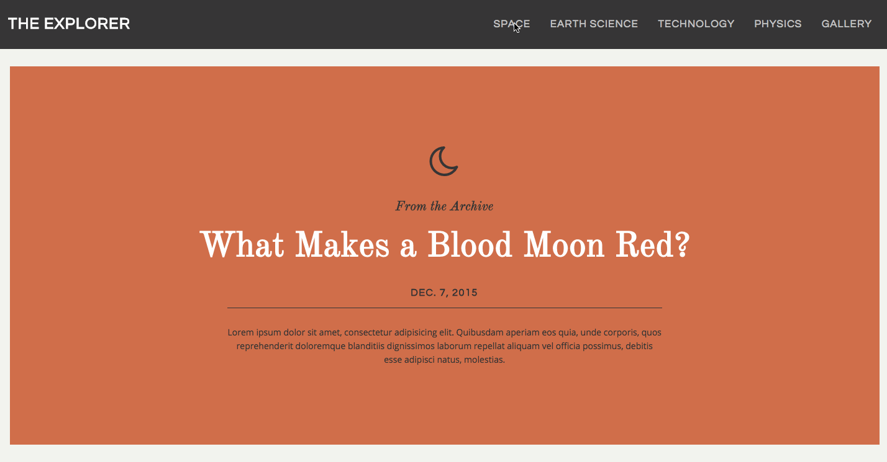

# Overview
You have been hired as the Front-End Developer for The Explorer, a science and technology education site. You have finished the HTMl and CSS for the site and you're working through some of the interactions for the page.

## Question 1

### The Problem
Your goal is to implement an interactive navigation bar that slides down and provides the user with sub-navigation options when the user clicks on a link in the main nav. You have already written the HTML and CSS for the navigation bar and the last step is to add functionality with JavaScript. You have been provided an animated design mockup to work from.

### What to Code:

Write JavaScript to make the menu interactive.

When the user clicks on a navigation item, you will need to:

- Add a class to the link the user clicked on (hint: you can use the “active” class)
- Slide down the secondary nav bar
- Fade in the related sub-navigation section.

If the user clicks on a link that is already active you will need to:
- Remove the active state from all menu items
- Slide up the secondary nav bar.

You will not need to alter any HTML or CSS.

## Question 2

### The Problem
The Designer you are working with designs a slideshow to add visual interest to the page. In order to make the slideshow more extensible and improve load-time, you decide to load the slideshow asynchronously.

### What to Code:
Write a function that runs once the document is ready, loads a file that includes a "slideshow" object of nested slideshow entry objects, each containing an "image" and "caption". Parse and create a photo slideshow with an  for each slideshow entry using the "image" value for the "src" attribute and the "caption" value for the "title" and "alt" attributes.

## Question 3

### The Problem
- When page first loads, load the first 4 posts from the archive. Create functions that load JSON data about archive posts asynchronously from the Explorer backend and using provided templates to render that on the page.

Each call to service will return 4 posts, based on a given index offset, each with:

category
title
date
blurb

NOTE: The "category" will be the Font Awesome class needed to display the appropriate icon (in the form "fa-____"). For more information on Font Awesome, see [this documentation](https://fortawesome.github.io/Font-Awesome/)

When user clicks on the "Load More" button, display loading icon and message: "Exploring the archive ..."
- Perform AJAX request to REST API and attach a callback function.
- The callback function should behave:
-- If JSON response includes { posts: [...] } data, render template and display, replacing the loading icon and message.
-- If JSON response doesn't have any posts, indicate end of the archive.
-- If response fails (not a 200 HTTP response), hide the loading icon and display the message "Houston, we have a problem."

### What to Code:

