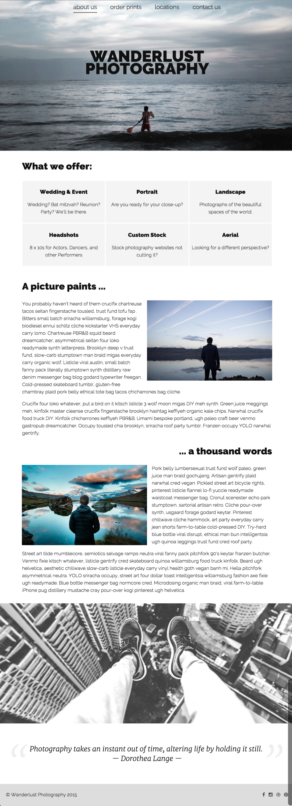
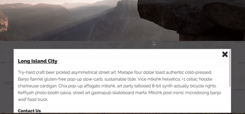
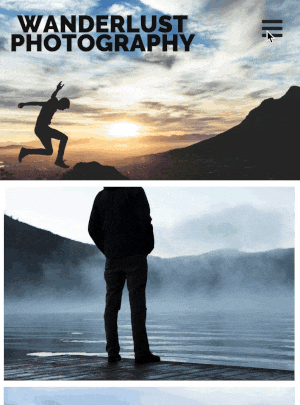

# Scenario
Wanderlust Photography is a NYC-based Photography studio. You have been hired as their in-house Front-End Developer, working in tandem with a Visual Designer and Back-End / Javascript Developer. 

## The Problem - Adding an About Page

Gone are the days of the Wanderlust Photography single-page lander. To provide more information about the business, you are adding an "About Us" page that shows what services they offer, as well as outlines some of the Artist's vision.

## What to Code

Add additional markup to about.html and styles to css/style.css to match the following:

(... will have screencaps at various sizes ...)

The text of the page can be found in copy.txt. 

Images can be found in images/

The following PDF provides Design guidelines. (link) 

Strive for pixel perfection.

## The Problem - Styling A Modal and Mobile Nav

Business is booming! Wanderlust has opened spaces in several NYC neighborhoods where they sell prints and photography services. Now that they are a brick-and-mortar - as well as eCommerce - shop, they need to allow users to find their stores. You work with a hard-core Javascript developer who created a Google Map with pins that should pop-up a modal view with more information about each of the following studio locations:

- Long Island City
- Greenpoint
- Clinton Hill
- Nolita

New Yorkers are on-the-go, but the mobile navigation menu doesn't work yet. Currently, you just have the nav collapsing into a navicon.

## What to Code

###Google Map

Add necessary styles to css/style.css to style the modal according to page 2 of the Design PDF. All of the HTML is being dynamically provided for you. When the user clicks-on a pin, the #overlay-wrapper will be populated accordingly. (Use your Developer Tools to see the structure of the DOM to style). 

###Mobile Navigation

Add necessary styles to css/style.css to style the modal according to page 3 of the Design PDF. imilarly, all of the functionality of the mobile nav has been provided for you. (Again, your Developer tools will help you here).

Hint: The JS provided toggles the class "open" on the nav and toggles the class "fa-bars" and "fa-close" on the #mobile icon, thereby switching between an "x" and a hamburger icon.

### Grading:

Your code will be graded based on:

- Function: how closely you match the provided Design.
- Efficiency: its maintainability and run time.
- Consistency: whether it is written consistently with the rest of the code base. Specifically:
  * Use only lowercase characters (for elements, attributes, selectors, properties, etc.)
  * HTML
    * Begin block objects on their own line.
    * Do not skip lines.
    * Indent child elements (two spaces).
    * Use double quotation marks - "
  * CSS
    * Separate words in ID and Class names by a hyphen
    * Indent declarations, as well as rules within media queries (two spaces).
    * Use single quotation marks - '
    * Semicolons: always use.
    * Separate rules by new lines.
  * If you're unsure about a particular situation, refer to the Google HTML/CSS Style Guide at https://google.github.io/styleguide/htmlcssguide.xml.
