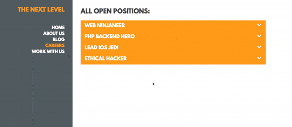

# The Next Level

## Build three features for The Next Level, a digital marketing agency.

## Career Page Accordion

### Instructions

The Next Level wants you to build an accordion on the Careers page.

This accordion will show and hide job information when a user clicks on a job title.

The team's designer has provided you with the following visualization:



When the user clicks on a job title with a closed job information panel:

- Close any open job information panels with a sliding animation.
- Change the chevron in the job title of any open job information panel from pointing up to pointing down.
- Open the corresponding job information panel with a sliding animation.
- Change the chevron in the job title from pointing down to pointing up.

When the user clicks on a job title with an open job information panel:

- Close that job information panel with a sliding animation.
- Change the chevron in the job title from pointing down to pointing up.

Possible states of chevron:

```html
<span class="fa fa-chevron-down">
<span class="fa fa-chevron-up">
```

_Hint_: Switching between the classes `fa-chevron-down` and `fa-chevron-up` will change the chevron appropriately. For more information on Font Awesome, see [this documentation.](https://fortawesome.github.io/Font-Awesome/).

**Write your code in `accordion.js`. When you've finished, upload `accordion.js`.**

**Do not alter any of the HTML or CSS - the team has already completed these files.**

---

### Grading

You will be graded on:

- Function (75%): The extent to which your code creates the specified functionality
- Efficiency (20%): The maintainability of your code, which is impacted by its size and the computational effort required to run it
- Consistency (5%): How well your code adheres to the style guide below. 

---

### Style guide

Semicolons: 

- Always use.

Naming: 

- Use camel case everywhere but constants
- Use all caps snake case for constants.

Strings: 

- Use single quotes.

Curly Braces: 

- Start your curly braces on the same line as whatever they're opening.

Spacing: 

- Indent new lines two spaces
- Put a space between arguments in a function
- For parentheses/curly brackets, no spaces after opening and before closing bracket

## Home Page Smooth Scroll

### Instructions

The Next Level wants you to build a Smooth Scroll effect on the homepage. 

Clicking through the right-hand navigation will allow the user to scroll-through the page.

The team's designer has provided you with the following visualization:


When the user clicks on an anchor in the right-hand `<aside>`:

- Scroll to the slide that corresponds to that anchor (the anchor's `href` will point to a particular slide's `id`)
- Style the circle that was clicked on with a solid fill
- Style all other circles with an outline only, no fill

When the user scrolls through the page:

- Detect the current scroll position. 
- Check if the scroll position has passed a specified threshold (the halfway point of the slide) 
- If so:
  * Change the currently-solid dot to be outlined.
  * Change the next slide's corresponding dot to be solid.

For instance, if the scroll position is between `0` and `threshold1`, the first dot should be selected. If the scroll position is between `threshold1` and `threshold2`, the second dot should be selected, etc.

_Note_: These thresholds have been provided for you in `scroll.js`.

Example states of `<aside>` anchors:

```html
<a href="#slide1" class="fa fa-circle"></a>
<a href="#slide1" class="fa fa-circle-o"></a>
```

_Hint_: Switching between the classes `fa-circle` and `fa-circle-o` will change the dot appropriately. For more information on Font Awesome, see [this documentation.](https://fortawesome.github.io/Font-Awesome/).

_Hint_: Be sure to keep scroll events from accumulating. Previous scroll animations should be terminated before a new one starts. 

**Write your code in `scroll.js`. When you've finished, upload `scroll.js`.**

**Do not alter any of the HTML or CSS - the team has already completed these files.**

---

### Grading

You will be graded on:

- Function (75%): The extent to which your code creates the specified functionality
- Efficiency (20%): The maintainability of your code, which is impacted by its size and the computational effort required to run it
- Consistency (5%): How well your code adheres to the style guide below. 

---

### Style guide

Semicolons: 

- Always use.

Naming: 

- Use camel case everywhere but constants
- Use all caps snake case for constants.

Strings: 

- Use single quotes.

Curly Braces: 

- Start your curly braces on the same line as whatever they're opening.

Spacing: 

- Indent new lines two spaces
- Put a space between arguments in a function
- For parentheses/curly brackets, no spaces after opening and before closing bracket

## Load Posts by Category

### Instructions

The Next Level wants to show articles on the Blog page but not overwhelm the user.

They've decided that when the Blog page first loads, the most recent article from each category will appear. 

From there, clicking on any category will load all the articles in that category.

The team's designer has provided you with the following visualization:


When the Blog page first loads:

- Initially, there are no articles on the page
- Initially, there are no categories selected.
- Once the page has loaded, 
  * The Recent category becomes selected.
  * An AJAX request loads the most recent post of each category from the archive.

When a user clicks on the Recent link:

- Any currently-loaded articles are removed.
- The loading icon is displayed.
- The Recent category becomes selected.
- No other categories are selected.
- An AJAX request loads the most recent post of each category from the archive.

When the user clicks on Advertising, Culture, Design or Technology:

- Any currently-loaded articles are removed.
- The loading icon is displayed.
- The specified category becomes selected.
- No other categories are selected.
- An AJAX request loads all the posts from the specified category from the archive.

Attach a callback function to the AJAX request that:

- Disables the loading icon.
- Creates DOM objects for each article with the conventions below.
- Populates the `#articles` section with said articles.

Articles should resemble:
```html
<article class="advertising">
  <h4>It's okay. Teddy loves you</h4>
  <h5>advertising<span class="date">March 22, 2016</span></h5>
  <figure>
    <figcaption>Photo Credit 1</figcaption>
  </figure>
  <p>Aromatic foam, as variety cup, black brewed rich caramelization caffeine pumpkin spice acerbic café au lait, strong aftertaste shop affogato espresso roast.</p>
  <p class="read-more"><a href="#">read more ...</a></p>
</article>
```

---

### How To Get Articles

Hitting the following URLs:

https://credentials-api.generalassemb.ly/78a475a4-20e2-4905-a7c7-8a10ec43fa27

- returns 4 posts, the most recent of each category, from the archive

https://credentials-api.generalassemb.ly/78a475a4-20e2-4905-a7c7-8a10ec43fa27?category=[CATEGORY NAME]

- returns all posts from the [CATEGORY NAME] category

Each call to the service will return one to many posts, each with:

- title
- category
- date
- image
- credit
- blurb
- permalink

For our purposes, the permalink will always be `#` and the image will always be a relative path to the local `images/` folder

The returned JSON object will resemble the following:

```json
{  
   "articles":[  
      {  
         "title":"It's okay. Teddy loves you",
         "category":"advertising",
         "date":"March 22, 2016",
         "image":"images/blog/1.jpg",
         "credit":"Photo Credit 1",
         "blurb":"Aromatic foam, as variety cup, black brewed rich caramelization caffeine pumpkin spice acerbic café au lait, strong aftertaste shop affogato espresso roast.",
         "permalink":"#"
      },
      ...
   ]
}

```

**Write your code in `blog.js`. When you've finished, upload `blog.js`.**

**Do not alter any of the HTML or CSS - the team has already completed these files.**

---

### Grading

You will be graded on:

- Function (75%): The extent to which your code creates the specified functionality
- Efficiency (20%): The maintainability of your code, which is impacted by its size and the computational effort required to run it
- Consistency (5%): How well your code adheres to the style guide below. 

---

### Style guide

Semicolons: 

- Always use.

Naming: 

- Use camel case everywhere but constants
- Use all caps snake case for constants.

Strings: 

- Use single quotes.

Curly Braces: 

- Start your curly braces on the same line as whatever they're opening.

Spacing: 

- Indent new lines two spaces
- Put a space between arguments in a function
- For parentheses/curly brackets, no spaces after opening and before closing bracket
